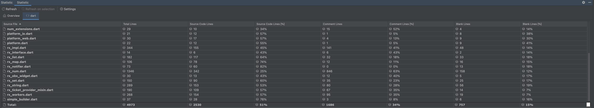

精简后的getx，仅包含响应式状态管理、以及一些很方便工具扩展函数，移除路由、依赖绑定、http请求、GetBuilder、Getx等api，
整个项目源码已不到3000行，核心源码估计在1000行左右，通过简单计算器程序测试，打包后的体积差距仅有8kb。


# 保留了哪些？

- obs 响应式变量
- Get.put、Get.find 依赖注入、依赖获取
- ever、once、interval... 响应式副作用函数，全部都保留
- context 扩展函数
- num 扩展函数
- get_util 工具类
- platform 获取平台类型工具类

# 移除了哪些?

除了上面列出来的，全部都移除掉了。

# 计数器示例

- 1.创建控制器

```dart
class Controller extends GetxController {
  /// 通过[Controller.of]的方式获取控制器实例，它不存在任何副作用，同时对性能基本没有影响，
  /// 但推荐你在偶尔需要用到控制器的地方使用它
  static Controller get of => Get.find();

  final count = 0.obs;

  addCount() => count.value++;
}
```

- 2.在页面上绑定控制器，与Getx官方示例不同的是，你必须在dispose生命周期中手动销毁控制器，
  因为我们已经移除了Getx路由相关的api，它无法自动感知何时销毁控制器

```dart
class CountPage extends StatefulWidget {
  const CountPage({super.key});

  @override
  State<CountPage> createState() => _CountPageState();
}

class _CountPageState extends State<CountPage> {
  final c = Get.put(Controller());

  @override
  void dispose() {
    super.dispose();
    Get.delete<Controller>();
  }

  @override
  Widget build(BuildContext context) {
    return Scaffold(
      appBar: AppBar(
        title: const Text('计数器示例'),
      ),
      body: Center(
        child: Column(
          children: [
            ElevatedButton(
              onPressed: () {
                // 通过of获取控制器
                Controller.of.addCount();
              },
              child: Obx(() => Text('count: ${c.count.value}')),
            ),
            ElevatedButton(
              onPressed: () {
                Navigator.of(context).push(MaterialPageRoute(builder: (context) => Child()));
              },
              child: const Text('子页面'),
            ),
          ],
        ),
      ),
    );
  }
}
```

- 3.其他页面若需要访问全局状态，只需通过Get.find()获取之前注册的控制器，或者通过定义的of静态方法直接访问控制器

```dart
class Child extends StatelessWidget {
  Child({super.key});

  final Controller c = Get.find();

  @override
  Widget build(BuildContext context) {
    // 不管在哪定义都没关系，看自己喜好
    // Controller c = Get.find();
    return Scaffold(
      appBar: AppBar(
        title: const Text('子页面'),
      ),
      body: Center(
        child: Column(
          children: [
            ElevatedButton(
              onPressed: () {
                c.count.value++;
              },
              // 通过of获取控制器
              child: Obx(() => Text('count: ${Controller.of.count.value}')),
            ),
          ],
        ),
      ),
    );
  }
}

```

# 操作各种类型的响应式变量

- 基础类型

```dart
class Controller extends GetxController {
  final intType = 0.obs;
  final doubleType = 0.0.obs;
  final stringType = 'hello'.obs;
  final boolType = false.obs;

  updateIntType() => intType.value++;

  updateDoubleType() => doubleType.value += 0.5;

  updateStringType() => stringType.value = stringType.value == 'hello' ? '你好' : 'hello';

  updateBoolType() => boolType.value = !boolType.value;
}

void page() {
  Column(
    children: [
      ElevatedButton(
        onPressed: c.updateIntType,
        child: Obx(() => Text('int type: ${c.intType.value}')),
      ),
      ElevatedButton(
        onPressed: c.updateDoubleType,
        child: Obx(() => Text('double type: ${c.doubleType.value}')),
      ),
      ElevatedButton(
        onPressed: c.updateStringType,
        child: Obx(() => Text('string type: ${c.stringType.value}')),
      ),
      ElevatedButton(
        onPressed: c.updateBoolType,
        child: Obx(() => Text('bool type: ${c.boolType.value}')),
      ),
    ],
  );
}
```

- Map类型

```dart
class Controller extends GetxController {
  final map = <String, dynamic>{'name': 'hihi', 'age': 20}.obs;

  /// 通过.value更新Map整个对象
  updateList() => map.value = {'name': 'eeee', 'age': 0};

  /// 通过update更新单个属性
  updateName() {
    map.update('name', (value) => value == 'hihi' ? 'hello' : 'hihi');
  }

  /// 通过key直接修改value，getx对最外面一层修改做了拦截
  updateAge() {
    map['age']++;
  }
}

void page() {
  Column(
    children: [
      ElevatedButton(
        onPressed: c.updateList,
        child: Obx(() => Text('update map: ${c.map}')),
      ),
      ElevatedButton(
        onPressed: c.updateName,
        child: Obx(() => Text('update map name: ${c.map}')),
      ),
      ElevatedButton(
        onPressed: c.updateAge,
        child: Obx(() => Text('update map age: ${c.map}')),
      ),
    ],
  );
}
```

- 嵌套Map类型
- Getx只做了一层拦截，你如果修改深层嵌套属性，则必须手动调用refresh来触发页面刷新
- 此逻辑同样适用于List，凡是深层变量更新你都必须手动刷新

```dart
class Controller extends GetxController {
  /// 嵌套map
  final nestMap = <String, Map<String, dynamic>>{
    '001': {'name': 'hihi', 'age': 20},
    '002': {'name': 'dada', 'age': 18},
  }.obs;

  /// 原理和上面基础Map的[updateAge]一样，getx对最外面一层做了拦截
  updateNestMap(String key) => nestMap[key] = {'name': 'eeee', 'age': Random().nextInt(100)};

  /// 更新嵌套Map中的单个属性，你必须手动调用refresh方法进行刷新，因为getx仅做了一层拦截
  updateNestFirstMapName() {
    final key = nestMap.keys.first;
    nestMap[key]!['name'] = nestMap[key]!['name'] == 'hihi' ? 'hello' : 'hihi';
    nestMap.refresh();
  }

  /// 更新最后一条Map的age
  updateNestLastMapAge() {
    final key = nestMap.keys.last;
    nestMap[key]!['age']++;
    nestMap.refresh();
  }
}

void page() {
  Column(
    children: [
      Obx(
            () =>
            Column(
              mainAxisSize: MainAxisSize.min,
              children: c.nestMap.values.map((v) => Text(v.toString())).toList(),
            ),
      ),
      ElevatedButton(
        onPressed: () {
          c.updateNestMap(c.nestMap.keys.first);
        },
        child: const Text('update first nest map'),
      ),
      ElevatedButton(
        onPressed: () {
          c.updateNestFirstMapName();
        },
        child: const Text('update first nest map name'),
      ),
      ElevatedButton(
        onPressed: () {
          c.updateNestLastMapAge();
        },
        child: const Text('update last nest map age'),
      ),
    ],
  );
}
```

- List类型(基础类型)

```dart
class Controller extends GetxController {
  final list = [1, 2, 3].obs;

  /// 清空数据
  clear() => list.clear();

  /// 添加数据
  add(int value) => list.add(value);

  /// 更新指定下标数据
  updateList(int index) => list[index]++;
}

void page() {
  Scaffold(
    appBar: AppBar(
      title: const Text('响应式List - 基础类型'),
      actions: [
        IconButton(
          onPressed: () {
            c.add(c.list.length + 1);
          },
          icon: const Icon(Icons.add),
        ),
        IconButton(
          onPressed: () {
            c.clear();
          },
          icon: const Icon(Icons.delete),
        ),
      ],
    ),
    body: Obx(
          () =>
          ListView.builder(
            itemCount: c.list.length,
            itemBuilder: (context, i) =>
                ListTile(
                  onTap: () {
                    c.updateList(i);
                  },
                  title: Text(c.list[i].toString()),
                ),
          ),
    ),
  );
}
```

- List类型(Map类型)

```dart
class Controller extends GetxController {
  final list = <Map<String, dynamic>>[
    {'name': 'hihi', 'age': 20}
  ].obs;

  /// 清空数据
  clear() => list.clear();

  /// 添加数据
  add() => list.add({'name': 'hihi', 'age': 20});

  /// 更新指定下标数据
  updateList(int index) => list[index] = {'name': 'hello', 'age': 100};

  /// 更新指定下标Map对象的部分数据
  part(int index) => list[index] = {...list[index], 'age': 1000};

  /// 直接修改内部属性，需要调用refresh手动刷新页面
  part2(int index) {
    list[index]['age'] = 1000;
    list.refresh();
  }
}

void page() {
  Scaffold(
    appBar: AppBar(
      title: const Text('响应式List - Map类型'),
      actions: [
        IconButton(
          onPressed: () {
            c.add();
          },
          icon: const Icon(Icons.add),
        ),
        IconButton(
          onPressed: () {
            c.clear();
          },
          icon: const Icon(Icons.delete),
        ),
      ],
    ),
    body: Obx(
          () =>
          ListView.builder(
            itemCount: c.list.length,
            itemBuilder: (context, i) =>
                ListTile(
                  onTap: () {
                    c.updateList(i);
                  },
                  onLongPress: () {
                    c.part2(i);
                  },
                  title: Text(c.list[i].toString()),
                ),
          ),
    ),
  );
}
```

- List类型(Model类型)

```dart
class User {
  User({required this.name, required this.age});

  String name;
  int age;

  User copyWith({
    String? name,
    int? age,
  }) {
    return User(
      name: name ?? this.name,
      age: age ?? this.age,
    );
  }

  @override
  String toString() {
    return 'User{name: $name, age: $age}';
  }
}

class Controller extends GetxController {
  final list = <User>[
    User(name: 'hihi', age: 20),
  ].obs;

  clear() => list.clear();

  add() => list.add(User(name: 'hihi', age: 20));

  updateList(int index) => list[index] = User(name: 'hihi', age: list[index].age + 1);

  part(int index) => list[index] = list[index].copyWith(age: 1000);

  /// 原理一样，直接修改内部属性需要手动刷新
  part2(int index) {
    list[index].age = 1000;
    list.refresh();
  }
}

void page() {
  Scaffold(
    appBar: AppBar(
      title: const Text('响应式List - Model类型'),
      actions: [
        IconButton(
          onPressed: () {
            c.add();
          },
          icon: const Icon(Icons.add),
        ),
        IconButton(
          onPressed: () {
            c.clear();
          },
          icon: const Icon(Icons.delete),
        ),
      ],
    ),
    body: Obx(
          () =>
          ListView.builder(
            itemCount: c.list.length,
            itemBuilder: (context, i) =>
                ListTile(
                  onTap: () {
                    c.updateList(i);
                  },
                  onLongPress: () {
                    c.part2(i);
                  },
                  title: Text(c.list[i].toString()),
                ),
          ),
    ),
  );
}
```